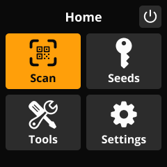
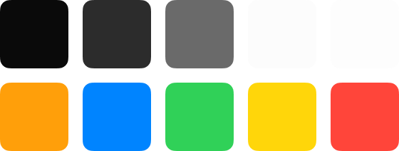

# SeedSigner Design System

### Contents:

* [Overview](#overview)
	- [Design Goals](#design-goals)
	- [Proposed Enhancements](#proposed-enhancements)
* [Key Performance Indicators](#key-performance-indicators)
* [Design System](#design-system)
	- [Spacing](#spacing)
	- [Components](#components)
	- [Color palette](#color-palette)
	- [Icons](#iconography)
	- [Interactions](#interactions)
* [Content Strategy](#content-strategy)
	- [IA Best Practices](#ia-best-practices)

---

## Overview

A modern, user-friendly GUI to make the SeedSigner software interface more accessible to non-technical users.

### Design Goals:

* **Visual Design:** Improve aesthetics and provide visual aids using UI treatments and iconography.
* **Interaction Design:** Increase overall efficiency of user inputs and feedback.
* **Information Architecture:** Improve findability by organizing and surfacing common tasks.
* **Content Design:** Simplify language to make abstract concepts more accessible to the average user.

### Proposed Enhancements:

* **Navigation:** Add Navigation Bar for context of location and easier access to global navigation functions
* **IA:** Accessible groupings of features, surface high-traffic actions
* **Content:** Simplify labels for viewport optimization and localization
* **Visual:** Add iconography to reduce cognitive load and aid localization
* **Visual:** Change font (Impact) to a more legible but space-efficient typeface

---

## Key Performance Indicators

* **Efficiency** - Speed (less time/taps, more efficient paths)
	- Minimize button presses
	- More information with less scrolling
	- Predictable interactions and placement
* **Findability** 
	- Context of location (clear labeling, titles)
	- Menu IA (card sorting, tree testing)
* **Overall Satisfaction** (qualitative)
	- Ease-of-use
* **Project Success Measures**
	- Enclosure and pre-built device sales
	- Social media engagement
	- Increased awareness to targeted features
	- Reduction in support requests / complaints for targeted pain points

---

## Design System

**Prototype:** [Figma Prototype](https://www.figma.com/proto/SXln0v3bN0qE05kkP6wuED/seedsigner?page-id=0%3A1&node-id=2879%3A3954&viewport=241%2C48%2C0.31&scaling=min-zoom&starting-point-node-id=2879%3A3954&show-proto-sidebar=1)
* Arrow keys to navigate
* Space to select

**Design File:** [Figma](#)

**Included:**
* Menu Screens
* Primary User Flows
* Example Screens
* Components
* Colors (Dark Mode)
* Icons

### Spacing

**Standard Measurements (8px Grid System):**
* 4px
* 8px
* 12px
* 16px
* 24px
* 32px
* 64px

**Notes:**
* 8px margins maintained around layouts (224px usable space).
* 8px minumum padding between UI elements.
* Buttons/targets should be a minimum of 24px for legibility.

### Components

* **Navigation Bar** (240x48)
	* Back Arrow (left placement)
	* Location (13 char max, center placement)
	* Optional Global Entry Point (e.g. Sign Off/Settings, right placement) 

* **Menu Tile** (108x80)
	* Contains: Icon (40x40), Label (10 char max)

* **Buttons**
	* Large (224x32) - Standard CTAs (100% width)
	* Medium (108x32) - 2-up CTAs (50% width) 
	* Small (32x32) - General usage, Navigation Bar
	* XS (24x24) - Floating Action Buttons, Keyboard

* **List Item** (224x32)
	* Text
	* Text with icon

* **Dice Entry Button** (64x64)

* **Seed Word** (108x21)

#### Color Palette

* **Background:** #0A0A0A
* **Containers:** #2C2C2C

* **Primary Text:** #FCFCFC
* **Secondary Text:** #FCFCFC (70% opacity)

* **Green (Success):** #30D158
* **Yellow (Alert):** #FFD60A
* **Red (Warning/Error):** #FF453A

* **Blue (Hover/Active state):** #0084FF
* **Orange (Hover/Active state):** #FF9F0A

### Iconography

* **Menu:**
	* Tools
	* Sign
	* Settings
	* Power
	* Seed/Key
	* Passphrase
	* Generate XPUB
	* Generate Last Word
	* Wallet
	* Multi-Sig
	* Single-Sig
	* Network
	* QR Code
	* I/O Test
	* Info
	* Donate

* **Messaging:**
	* Confirmation
	* Alert
	* Error

* **Misc:**
	* Save
	* Available
	* Unavailable
	* Scan QR Code
	* Scan Image

### Interactions

* **Navigation:**
	* Next - Continue to next step
	* Done - End of flow, return to entry point (non-destructive)
	* OK/Close - Exit current screen (non-destructive)
	* Cancel - End task and return to entry point (destructive)

---

## Content Strategy

## IA Best Practices:

### Clear and concise labeling
_Categories and labels should be clear and meaningful to users._

**Navigational labels should:**
* Make sense to all users, not just to advanced Bitcoin users
* Be concise -- maximum of 2 words if possible
* Only lead with an action verb when it's necessary for clarity
* Use "&"" instead of "and" for readability and space efficiency
* Meet users' expectations of what they'll find at a destination

### Intuitive groupings
_Like items should be clustered for enhanced discoverability._

**Navigational groupings should:**
* Meet customer expectation (mental model)
* Consist of like items
* Adhere to cognitive load best practices
* Not have too many (or too few) items in a category

### Expected hierarchy
_The order of items should make sense and meet user expectations._

**Menu item hierarchy should:**
* Derive from user expectations
* Prioritize frequently-used and urgent tasks
* Leverage a common heirarchy of left-to-right or top-to-bottom based on frequency, urgency, and promoting awareness
* Utilize last position in a list (e.g. users expect Help/Contact near the bottom)

### Cognitive load control
_Decrease clutter that may confuse or distract users._

**To reduce cognitive load:**
* Limit the number of menus, categories, and items
* Avoid using a general category as a catch-all for orphan items
* Avoid visual clutter that may confuse or distract users

### Complementary contextual navigation
_When used, should align with the larger navigation ecosystem._

**Contextual navigation should:**
* Meet users' mental model for finding information and performing tasks
* Be easily visible and actionable
* Enhance but not duplicate the global navigation
* Create awareness of additional services/features

---

## Version History

**v0.1** __(2021-07-16)__
* Overview, design goals, proposed enhancements, preliminary design system

**v0.2** __(2021-09-14)__
* Table of contents, IA best practices, key performance indicators
